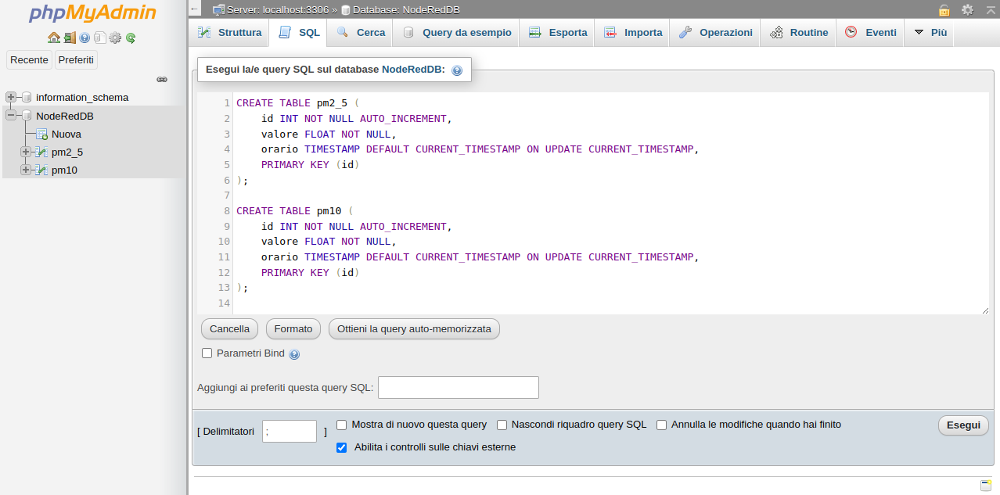

# Setup di un LAMP server e creazione di un DB su Raspberry Pi

## 1. Configurare un LAMP (Linux, Apache, MySQL, PHP) Server

### Aggiornare il sistema

```
sudo apt update && upgrade -y
```

### Installare Apache e PHP

```
sudo apt install apache2 php
```

### Installare MariaDB e il supporto a MySQL per PHP

```
sudo apt install mariadb-server php-mysql
```

### Installare phpMyAdmin.  

```
sudo apt install phpmyadmin
```

Durante l'installazione viene richiesto quale web server deve essere configurato per l'esecuzione di phpMyAdmin: selezionare apache2 con la barra spaziatrice e premere invio per confermare.

A fine installazione confermare la configurazione automatica del DB con dbconfig-common.

Infine, abilitare l'avvio automatico di MariaDB all'avvio, l'estensione PHP MySQLi e riavviare Apache2 coi seguenti comandi:

```
sudo systemctl enable mariadb
sudo phpenmod mysqli
sudo service apache2 restart
```

## 2. Creare un utente e un DB MySQL

Creiamo un database e un utente secondario per la gestione. Per farlo utilizziamo MySQL da terminale.

Eseguiamo il login con l'utente *root* inserendo la password scelta durante l'installazione:

```
sudo mysql -u root -p
```

Una volta loggati creiamo un database con nome *"testdb"*

```
CREATE DATABASE testdb;
```

e un utente che in questo esempio avrà nome *"topuser"* e password *"secretpassword"*. Assicurarsi di modificare il nome utente e la password prima della creazione dell'utente.

```
CREATE USER 'topuser'@'localhost' IDENTIFIED BY 'secretpassword';
```

Una volta creato l'utente è necesssario concedergli tutti i permessi per tutte le tabelle nel DB

```
GRANT ALL PRIVILEGES ON testdb.* TO 'topuser'@'localhost';
```

e infine salvare i privilegi appena concessi.

```
FLUSH PRIVILEGES;
```

## 3. Creare le tabelle nel DB

Non resta che creare le tabelle che ci permetteranno di memorizzare i dati ricevuti dall'ESPx.

Per farlo colleghiamoci a phpmyadmin dal browser

```
raspberryip/phpmyadmin
```

e dal tab SQL lanciamo le query seguenti per creare le tabelle.

```
CREATE TABLE pm2_5 (
    id INT NOT NULL AUTO_INCREMENT,
    valore FLOAT NOT NULL,
    orario TIMESTAMP DEFAULT CURRENT_TIMESTAMP ON UPDATE CURRENT_TIMESTAMP,
    PRIMARY KEY (id)
);

CREATE TABLE pm10 (
    id INT NOT NULL AUTO_INCREMENT,
    valore FLOAT NOT NULL,
    orario TIMESTAMP DEFAULT CURRENT_TIMESTAMP ON UPDATE CURRENT_TIMESTAMP,
    PRIMARY KEY (id)
);
```



Avanti al [prossimo step](./nodered_flow_chart.html)! :)
