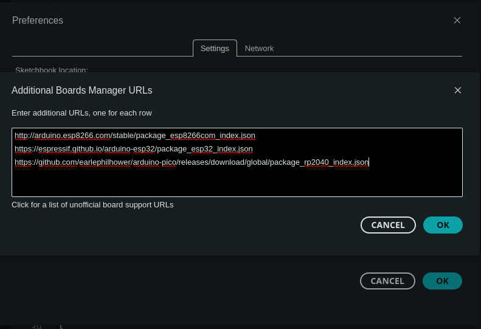
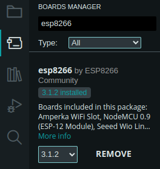
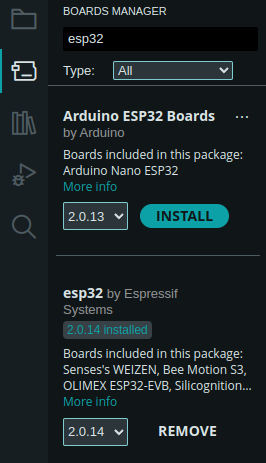

# Configurazione ESP8266 / ESP32

## 1. Installare Arduino IDE

[Scaricare](https://www.arduino.cc/en/software) e installare l'Arduino IDE

## 2. Installare la scheda ESP8266 / ESP32 nell'Arduino IDE

### ESP8266

1. Aggiungere https://arduino.esp8266.com/stable/package_esp8266com_index.json in "Additional Boards Manager URLs" nelle impostazioni dell'Arduino IDE
2. Installare il package di *ESP8266* per l'ESP8266 dal Board Manager

### ESP32

1. Aggiungere https://espressif.github.io/arduino-esp32/package_esp32_index.json in "Additional Boards Manager URLs" nelle impostazioni dell'Arduino IDE
2. Installare il package di *Espressif* per l'ESP32 dal Board Manager

Avanti al [prossimo step](./tests/esp_tests.html)! :)
