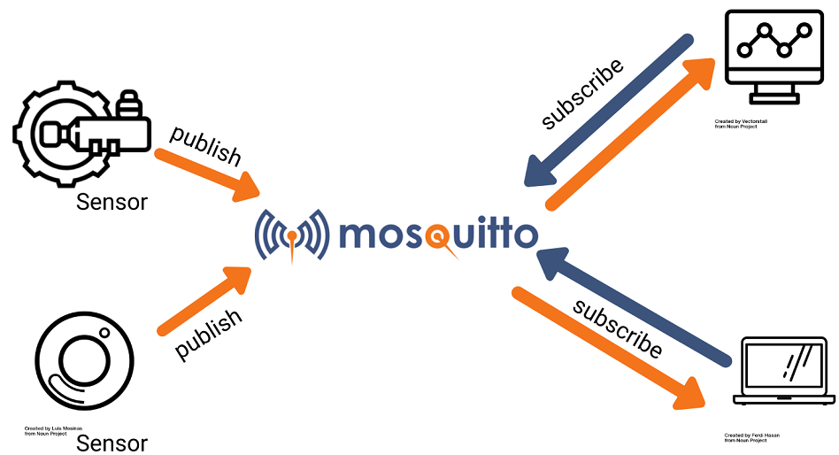

# Setup di NodeRED su Raspberry Pi

## 0. Cos'è un Broker MQTT

MQTT sta per Message Queuing Telemetry Transport ed è un protocollo di comunicazione semplice progettato per dispositivi con poca potenza e larghezza di banda limitata. Per questo è la soluzione perfetta per lo scambio di dati tra dispositivi IoT.

La comunicazione MQTT funziona come un sistema di publish and subscribe. I dispositivi pubblicano messaggi su topic specifici che ricevono tutti i dispositivi iscritti a quei topic.

Il broker MQTT si occupa di ricevere tutti i messaggi, filtrarli, decidere quali sono i topic interessati dai messaggi ricevuti e infine pubblicare i messaggi per tutti i client iscritti ai topic prescelti.

  
*Mosquitto*

Puoi approfondire ulteriormente [qui](https://mosquitto.org/).

## 1. Installazione del client Mosquitto

Eseguire da terminale i seguenti comandi:

```
sudo apt update && sudo apt upgrade
sudo apt install mosquitto mosquitto-clients -y
sudo systemctl enable mosquitto.service
mosquitto -v
```

## 2. Abilitazione dell'accesso remoto e autenticazione

Eseguire il comando seguente sostituendo YOUR_USERNAME con il nome dell'utente utilizzato per loggarsi e memorizzare nome utente e password:

```
sudo mosquitto_passwd -c /etc/mosquitto/passwd YOUR_USERNAME
```

Aprire il file mosquitto.conf con l'editor preferito:

```
sudo vim /etc/mosquitto/mosquitto.conf
```

e aggiungere la riga seguente all'inizio del file per permettere solo connessioni autenticate:

```
per_listener_settings true
```

e le righe seguenti alla fine del file:

```
allow_anonymous false
listener 1883
password_file /etc/mosquitto/passwd
```

Infine riavviare Mosquitto:

```
sudo systemctl restart mosquitto
```

Avanti al [prossimo step](./nodered_setup.html)! :)
