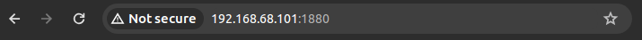
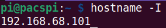
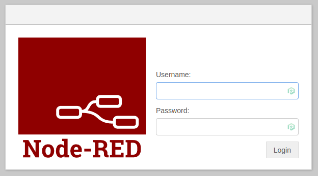
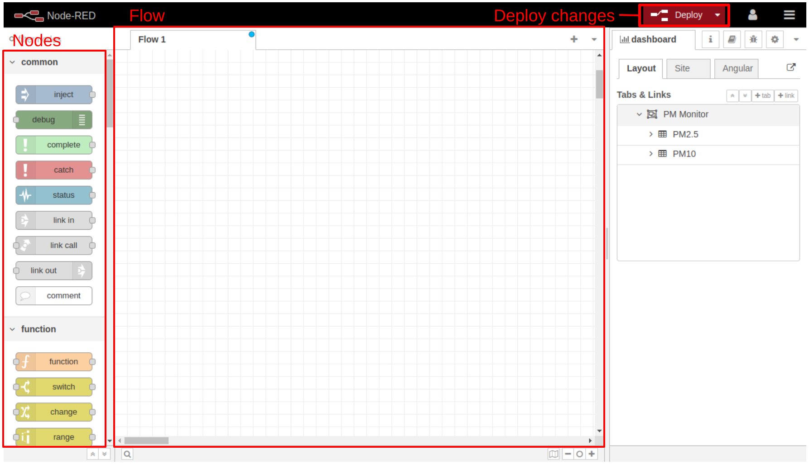
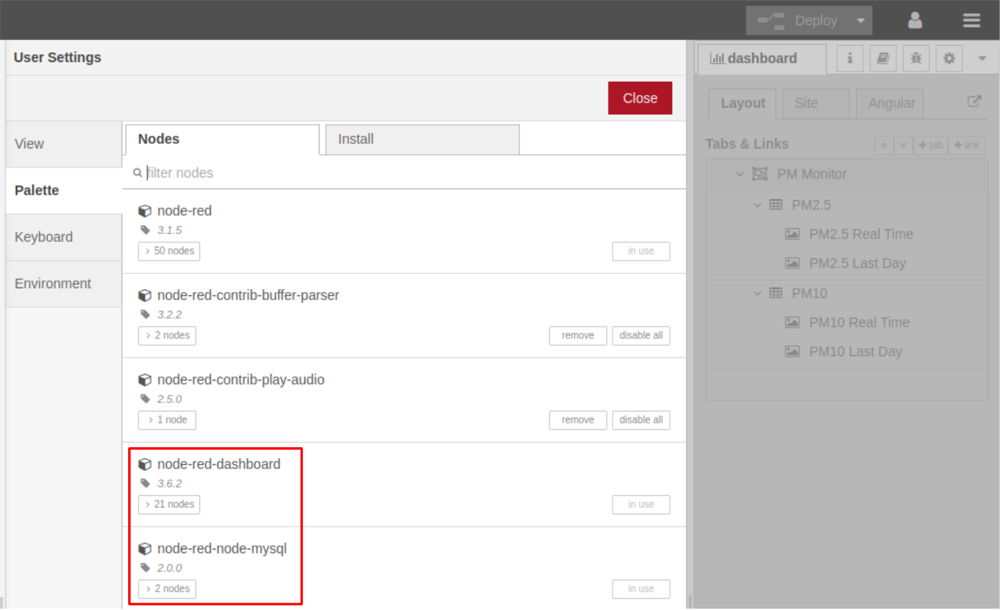

# Setup di Node-RED su Raspberry Pi

## 1. Collegarsi alla Dashboard di Node-RED

Una volta installato Node-RED è necessario configurare la Dashboard per visualizzare i dati che il Raspberry Pi riceverà dal nostro ESP.

Iniziamo collegandoci dal browser all'indirizzo ip con porta 1880 del Raspberry Pi.  
Esempio:

```
192.168.68.101:1880
```



Se non si conosce l'indirizzo ip del nostro Raspberry Pi è possibile trovarlo eseguendo il seguente comando:

```
hostname -I
```



A questo punto dovresti trovarti di fronte ad una schermata di login simile alla seguente:



## 2. Com'è fatta la Dashboard di Node-RED

Una volta eseguito il login si arriva all'interfaccia di Node-RED.



### Nodes

Nella sidebar a sinistra è possibile vedere una lista di blocchi chiamati *nodi* e suddivisi per funzionalità.  
I nodi hanno porte di input e/o di output per ricevere e inviare informazioni ad altri nodi precedenti o successivi.

### Flow

I nodi (*nodes*) sono i blocchi che costituiscono un diagramma (*flow*). Un diagramma rappresenta una sequenza di operazioni che portano all'esecuzione di un certo task.

Al centro della pagina c'è il Flow ed è dove andranno posizioni i nodi.

### Sidebar a destra

La sidebar a destra ha diverse funzioni:

1. *Information*: mostra le informazioni del flow
2. *Help*: mostra la documentazione dei nodi
3. *Debug*: l'icona dell'insetto apre una finestra che mostra i messaggi che passano dai nodi di debug
4. *Config nodes*: l'icona dell'ingranaggio mostra le informazioni configuration nodes. I configuration nodes sono nodi speciali che permettono di memorizzare configurazioni riutilizzabili in diversi nodi all'interno del diagramma

### Deploy

Il pulsante **deploy** salva lo stato del diagramma e lo carica nella UI.

## 2. Configurare la Dashboard di Node-RED

Installare due nodes aggiuntivi da *Menu --> Settings --> Palette --> Install*:

1. node-red-dashboard
2. node-red-node-mysql



Avanti al [prossimo step](./db_setup.html)! :)
