TODO: AGGIUNGERE CASO CON INVIO DI SEGNALE TRAMITE NODERED AD ESEMPIO PER ACCENDERE UN RELÈ

# Creazione del flow chart in Node-RED e della UI

## 1. Fare qualche test coi presenti in Node-RED

Iniziamo creando un flow chart coi nodi riportati di seguito e configuriamoli come indicato:

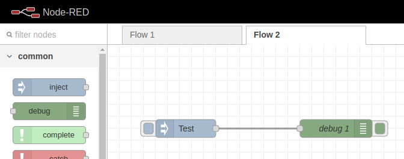

Configurare l'inject node:

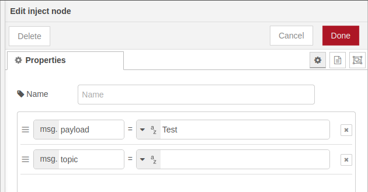

Configurare il debug node:

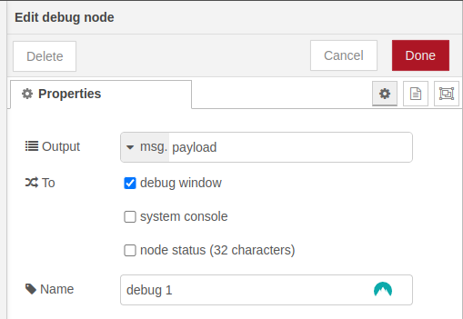

Se tutto è stato configurato correttamente, cliccando su *Deploy* e successivamente sul quadratino blu dell'inject node dovremmo vedere che riceviamo le stringe inviate al debug:

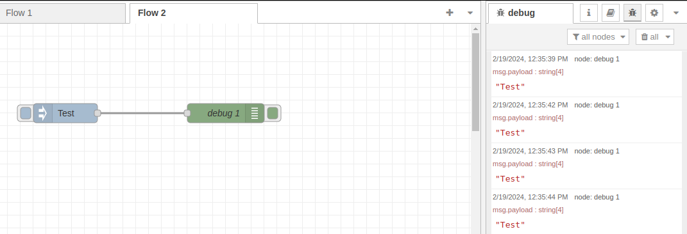

Per vedere la UI di Node-RED è necessario collegarsi alla pagina `raspberryip:1880/ui/`

## 2. Creazione del flow chart finale e della UI

Ora che abbiamo preso un po' di dimistichezza con l'utilizzo di Node-RED possiamo creare il flow chart finale che ci permetterà di far funzionare il nostro *sistema IoT* nella sua interezza:

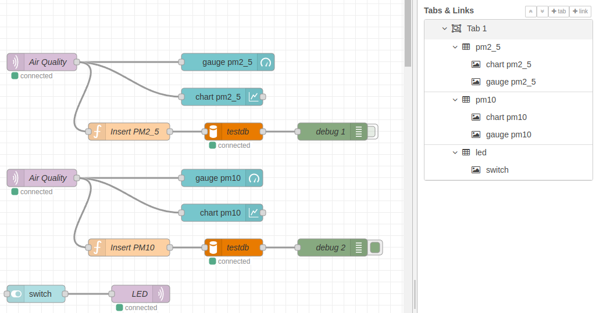

Configuriamo il nodo *mqtt_in*

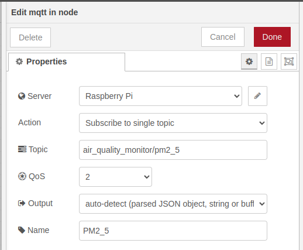

la sua connessione col *broker MQTT*

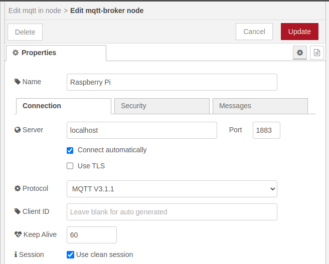

e le *credenziali di accesso*

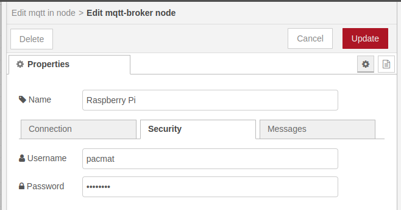

Configuriamo il nodo funzione che ci permetterà di creare la query con cui inserire nel DB i dati ricevuti dal microcontrollore

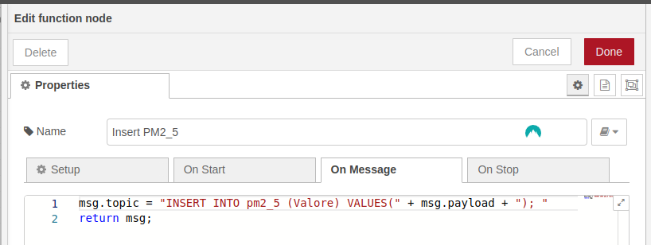

e il nodo per la connessione al DB

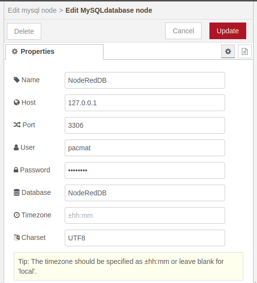

Se abbiamo configurato tutti i nodi correttamente e clicchiamo su **Deploy**, andando nel tab di *Debug* di Node-RED dovremmo vedere le query che vengono inviate al nostro DB

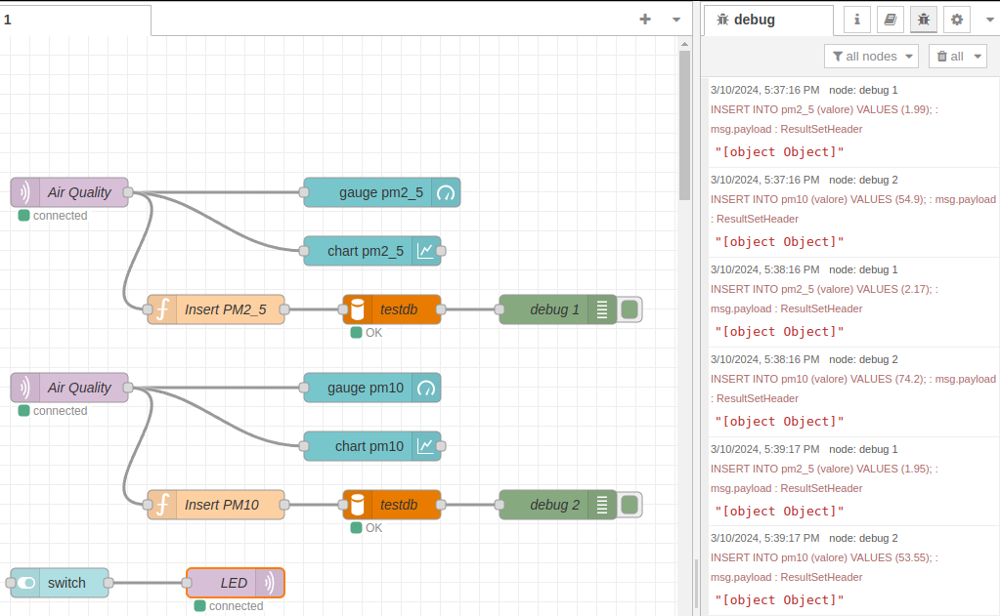

allo stesso tempo dovremmo veder variare i grafici nella UI

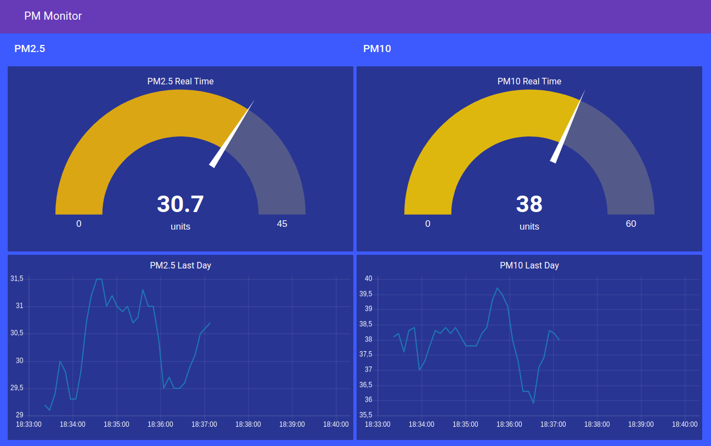

e il database dovrebbe popolarsi coi dati raccolti dal sensore

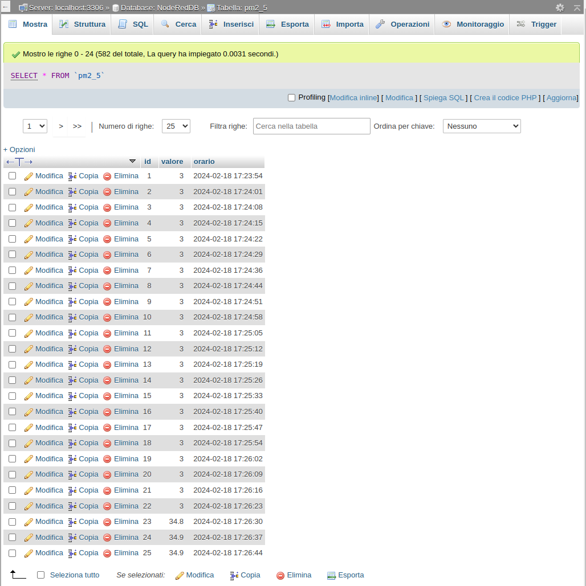

Avanti al [prossimo step](./index.html)! :)
