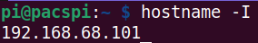
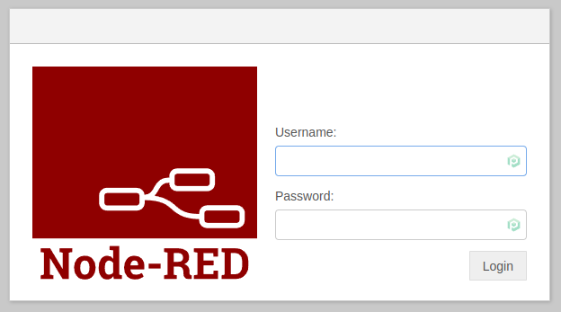
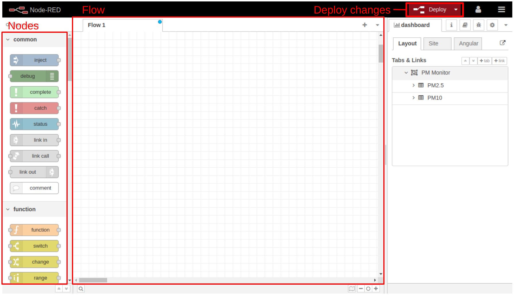

# Setup di Node-RED su Raspberry Pi

## 0. Cos'è Node-RED

Node-RED è un potente strumento open source ideato con lo scopo di semplificare la costruzione di applicazioni IoT.

Node-RED è fruibile tramite browser e tramite il visual programming permette di collegare blocchi di codice - *nodes* - per eseguire uno o più task. Più nodes collegati insieme sono detti flows.

### Perché Node-RED è un'ottima soluzione?

1. Node-RED è open source
2. Gira perfettamente su un Raspberry Pi
3. Essendo un tool di programmazione visuale, quindi è facilmente utilizzabile anche da utenti non esperti

### Cosa puoi fare con Node-RED?

1. Accedere al GPIO del tuo Raspberry Pi 
2. Stabilire una connessione MQTT con altri dispositivi
3. Creare in modo semplice un'interfaccia grafica per i tuoi progetti
4. Comunicare con servizi di terze parti
5. Molto altro!

  
*Node-RED*

Puoi approfondire ulteriormente [qui](https://mosquitto.org/) e trovare degli esempi di utilizzo [qui](https://flows.nodered.org/).

## 1. Installazione di Node-RED su Raspberry Pi

Lanciare il seguente comando da terminale:

```
bash <(curl -sL https://raw.githubusercontent.com/node-red/linux-installers/master/deb/update-nodejs-and-nodered)
```

e a installazione finita vi troverete di fronte ad una schermata simile a quella seguente:


Successivamente sarà necessario configurare Node-RED come impostando nome utente e passphrase e confermando le impostazioni di default delle altre voci:


Ora possiamo avviare Node-RED per verificare che l'installazione e la configurazione siano state eseguite correttamente. Lanciando da terminale il comando

```
node-red-start
```

dovremmo trovarci di fronte ad una schermata simile a questa:


Infine abilitiamo il servizio di Node-RED in modo che si avvii in automatico all'accensione del Raspberry Pi:

```
sudo systemctl enable nodered
```

## 2. Collegarsi alla Dashboard di Node-RED

Una volta installato Node-RED non rimane che configurare la Dashboard per visualizzare i dati che il Raspberry Pi riceverà dal nostro ESPx.

Iniziamo collegandoci dal browser all'indirizzo ip con porta 1880 del Raspberry Pi.  
Esempio:

```
192.168.68.101:1880
```


Se non si conosce l'indirizzo ip del nostro Raspberry Pi è possibile trovarlo eseguendo il seguente comando:

```
hostname -I
```



A questo punto dovresti trovarti di fronte ad una schermata di login simile alla seguente:



## 3. Configurare la Dashboard di Node-RED

Una volta eseguito il login si arriva all'interfaccia di Node-RED.



### Nodes

Nella sidebar a sinistra è possibile vedere una lista di blocchi chiamati *nodi* e suddivisi per funzionalità.  
I nodi hanno porte di input e/o di output per ricevere e inviare informazioni ad altri nodi precedenti o successivi.

### Flow
The nodes are the building blocks of a flow. You wire nodes together to create a flow that will perform a certain task. A Flow is also a tab in the workspace where you place and organize the nodes.

In the center, you have the Flow and this is where you place the nodes.

### Right Sidebar
The sidebar at the right has several tools.

Information: shows information about the flows;
Help: shows the nodes’ documentation;
Debug: the bug icon opens a debugging window that shows messages passed to debug nodes—it’s useful for debugging purposes;
Config nodes: the gear icon shows information about configuration nodes. Configuration nodes do not appear on the main workspace, and they are special nodes that hold reusable configurations that can be shared by several nodes in a flow.
Deploy
The deploy button saves all changes made to the flow and starts running the flow.

Avanti al [prossimo step](./index.html)! :)
