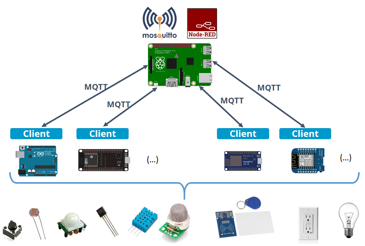
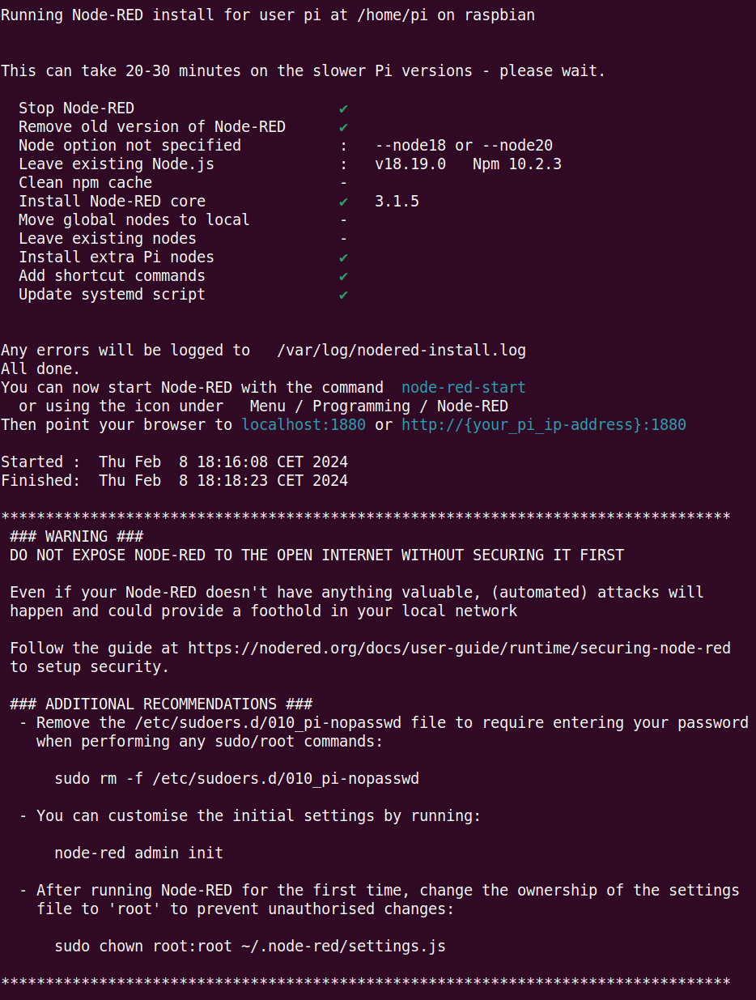
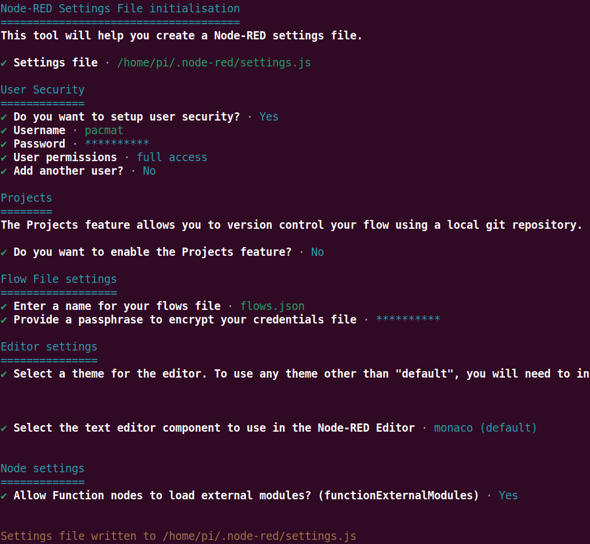
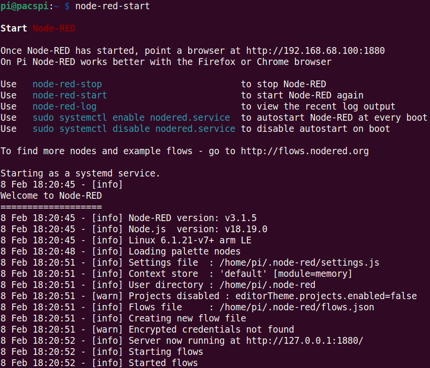

# Setup di Node-RED su Raspberry Pi

## 0. Cos'è Node-RED

Node-RED è un potente strumento open source ideato con lo scopo di semplificare la costruzione di applicazioni IoT.

Node-RED è fruibile tramite browser e tramite il visual programming permette di collegare blocchi di codice - *nodes* - per eseguire uno o più task. Più nodes collegati insieme sono detti flows.

### Perché Node-RED è un'ottima soluzione?

1. Node-RED è open source
2. Gira perfettamente su un Raspberry Pi
3. Essendo un tool di programmazione visuale, quindi è facilmente utilizzabile anche da utenti non esperti

### Cosa puoi fare con Node-RED?

1. Accedere al GPIO del tuo Raspberry Pi 
2. Stabilire una connessione MQTT con altri dispositivi
3. Creare in modo semplice un'interfaccia grafica per i tuoi progetti
4. Comunicare con servizi di terze parti
5. Molto altro!

  
*Node-RED*

Puoi approfondire ulteriormente [qui](https://mosquitto.org/) e trovare degli esempi di utilizzo [qui](https://flows.nodered.org/).

## 1. Installazione di Node-RED su Raspberry Pi

Lanciare il seguente comando da terminale:

```
bash <(curl -sL https://raw.githubusercontent.com/node-red/linux-installers/master/deb/update-nodejs-and-nodered)
```

rispondere y alle prime due domande che avvieranno l'installazione.  
A installazione finita vi troverete di fronte ad una schermata simile a quella seguente:



Successivamente sarà necessario configurare Node-RED come impostando nome utente e passphrase e confermando le impostazioni di default delle altre voci:



Ora possiamo avviare Node-RED per verificare che l'installazione e la configurazione siano state eseguite correttamente. Lanciando da terminale il comando

```
node-red-start
```

dovremmo trovarci di fronte ad una schermata simile a questa:



Infine abilitiamo il servizio di Node-RED in modo che si avvii in automatico all'accensione del Raspberry Pi:

```
sudo systemctl enable nodered
```

Avanti al [prossimo step](./nodered_config.html)! :)
