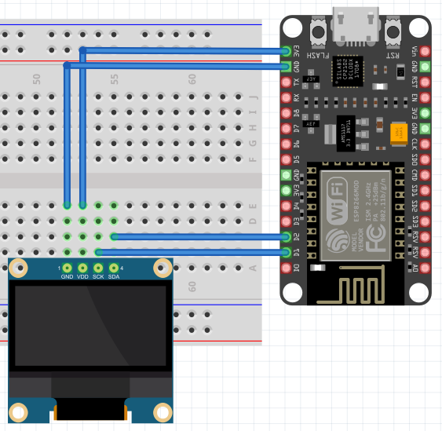
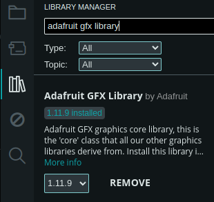
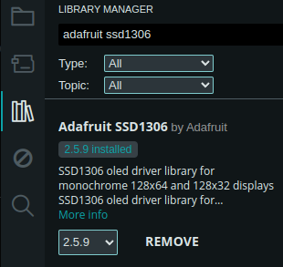

# Test del display SSD1306

## 1. Creare il seguente schema elettrico

Collegare i pin del display SSD1306 come segue:

1. VDD --> 3.3V ESPx
2. GND --> GND ESPx
3. SDA --> D2 ESPx
4. SCL --> D1 ESPx

  
*Display Wiring Diagram*

## 2. Installazione delle librerie

Installare le seguenti librerie nell'Arduino IDE:

1. Adafruit GFX Library by *Adafruit*  
     
2. Adafruit SSD1306 by *Adafruit*  
     

## 3. Eseguire il codice

Collegare l'ESPx al pc, copiare il codice seguente in un file nell'Arduino IDE e caricarlo sul microcontrollore.

```
#include <Wire.h>
#include <Adafruit_GFX.h>
#include <Adafruit_SSD1306.h>

#define SCREEN_WIDTH 128 // OLED display width, in pixels
#define SCREEN_HEIGHT 64 // OLED display height, in pixels
#define OLED_RESET -1 // Reset pin # (or -1 if sharing Arduino reset pin)
#define SCREEN_ADDRESS 0x3C

Adafruit_SSD1306 display(SCREEN_WIDTH, SCREEN_HEIGHT, &Wire, OLED_RESET);

void setup() {
    while (!display.begin(SSD1306_SWITCHCAPVCC, SCREEN_ADDRESS)) {
        Serial.println("Failed to boot SSD1306");
        delay(500);
    }
    display.clearDisplay();
    display.setTextSize(2);
    display.setTextColor(WHITE);
    display.setCursor(0, 12);
    display.print("Booting...");
    display.display();
    delay(2000);
}

void loop() {
    display.clearDisplay();
    display.setCursor(0, 12);
    display.print("Ciao! :)");
    display.display();

    delay(2000);

    display.clearDisplay();
    display.setCursor(0, 12);
    display.print("Evviva! :D");
    display.display();

    delay(2000);
}
```

Vedi [tutti i test](./esp_tests.html)! :)
