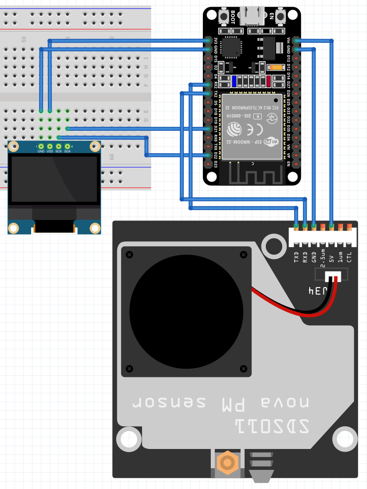

# Test del display SSD1306

## 1. Creare il seguente schema elettrico

Collegare i pin del sensore SDS011 come segue:

1. 5V --> Vin ESP32
2. GND --> GND ESP32
3. RXD --> TX2 ESP32
4. TXD --> RX2 ESP32

Collegare i pin del display SSD1306 come segue:

1. VDD --> 3.3V ESP32
2. GND --> GND ESP32
3. SDA --> D21 ESP32
4. SCL --> D22 ESP32

  
*ESP32 Wiring Diagram*

## 2. Installazione delle librerie

Installare le seguenti librerie nell'Arduino IDE:

1. Adafruit GFX Library by *Adafruit*  
     
2. Adafruit SSD1306 by *Adafruit*  
     

## 3. Eseguire il codice

Collegare l'ESP32 al pc, copiare il codice seguente in un file nell'Arduino IDE e caricarlo sul microcontrollore.

**ATTENZIONE**: modificare il codice seguente utilizzando la libreria [esp_sds011](https://github.com/dok-net/esp_sds011)

```
// libraries for display
#include <Wire.h>
#include <Adafruit_GFX.h>
#include <Adafruit_SSD1306.h>
#include <Fonts/FreeMono9pt7b.h>

// library for SDS011
#include <SoftwareSerial.h>

// SDS011 software serial pins
#define SDS_RX D5
#define SDS_TX D6
SoftwareSerial sds(SDS_RX, SDS_TX);

#define SCREEN_WIDTH 128 // OLED display width, in pixels
#define SCREEN_HEIGHT 64 // OLED display height, in pixels
#define OLED_RESET -1 // Reset pin # (or -1 if sharing Arduino reset pin)
#define SCREEN_ADDRESS 0x3C

Adafruit_SSD1306 display(SCREEN_WIDTH, SCREEN_HEIGHT, &Wire, OLED_RESET);

void setup() {
    // Initialize Serial communication with the computer
    Serial.begin(115200);
    delay(100);  // Short delay after initializing Serial
    Serial.println("Initializing SDS011 Air Quality Monitor...");
    // Initialize SoftwareSerial communication with SDS011
    sds.begin(9600);

    while (!display.begin(SSD1306_SWITCHCAPVCC, SCREEN_ADDRESS)) {
        Serial.println("Failed to boot SSD1306");
        delay(500);
    }
    display.clearDisplay();
    display.setFont(&FreeMono9pt7b);
    display.setTextColor(WHITE);
    display.setCursor(0, 10);
    display.print("Booting...");
    display.display();
    delay(2000);
}

void loop() {
    // Look for the starting byte of the SDS011 data frame
    while (sds.available() && sds.read() != 0xAA) { }
    if (sds.available()) {
        Serial.println("Data available from SDS011...");
    }

    String pm2_5_str;
    String pm10_str; 

    // Once we have the starting byte, attempt to read the next 9 bytes
    byte buffer[10];
    buffer[0] = 0xAA;  // The starting byte we already found
    if (sds.available() >= 9) {
        sds.readBytes(&buffer[1], 9);
        // Check if the last byte is the correct ending byte
        if (buffer[9] == 0xAB) {
            int pm25int = (buffer[3] << 8) | buffer[2];
            int pm10int = (buffer[5] << 8) | buffer[4];
            float pm2_5 = pm25int / 10.00;
            float pm10 = pm10int / 10.00;
            pm2_5_str = String(pm2_5, 2);
            pm10_str = String(pm10, 2);
            // Print the values
            Serial.print("PM2.5: ");
            Serial.print(pm2_5, 2);  // 2 decimal places
            Serial.print(" µg/m³   ");
            Serial.print("PM10: ");
            Serial.print(pm10, 2);  // 2 decimal places
            Serial.println(" µg/m³   ");
        } else {
            Serial.println("Invalid ending byte from SDS011.");
        }
    } else {
        Serial.println("Not enough data from SDS011.");
    }

    display.clearDisplay();
    display.display();
    delay(1000);
    display.setFont(&FreeMono9pt7b);
    display.setTextColor(WHITE);

    display.setCursor(0, 10);
    display.print("Analyzing");
    display.display();
    delay(1000);
    display.print(".");
    display.display();
    delay(1000);
    display.print(".");
    display.display();
    delay(1000);
    display.print(".");
    display.display();
    delay(1000);

    display.setCursor(0, 30);
    display.print("PM2.5: ");
    display.setCursor(0, 50);
    display.print(pm2_5_str);  // 2 decimal places
    display.print(" µg/m³");
    display.display();
    delay(5000);

    display.clearDisplay();
    display.setFont(&FreeMono9pt7b);
    display.setTextColor(WHITE);

    display.setCursor(0, 10);
    display.print("Analyzing...");
    display.setCursor(0, 30);
    display.print("PM10: ");
    display.setCursor(0, 50);
    display.print(pm10_str);  // 2 decimal places
    display.print(" µg/m³");
    display.display();
    delay(5000);
}
```
