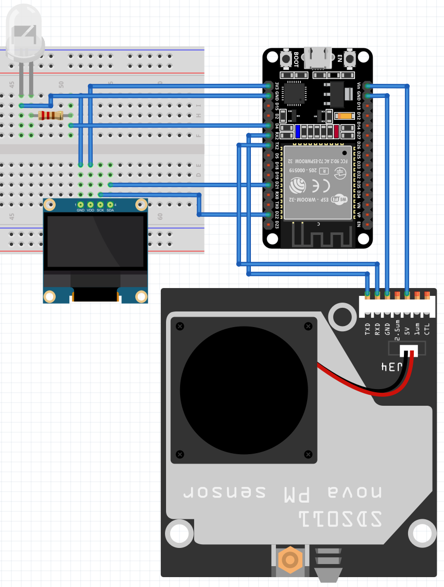
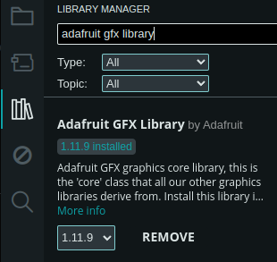
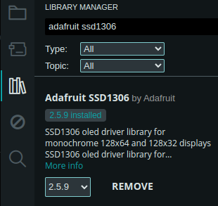
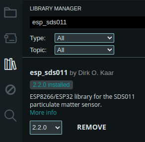

# Test del display SSD1306

## 1. Creare il seguente schema elettrico

Collegare i pin del sensore SDS011 come segue:

1. 5V --> Vin ESP32
2. GND --> GND ESP32
3. RXD --> TX2 ESP32
4. TXD --> RX2 ESP32

Collegare i pin del display SSD1306 come segue:

1. 5V --> Vin ESP32
2. GND --> GND ESP32
3. RXD --> TX2 ESP32 (GPIO17)
4. TXD --> RX2 ESP32 (GPIO16)

  
*ESP32 Wiring Diagram*

## 2. Installazione delle librerie

Installare le seguenti librerie nell'Arduino IDE:

1. Adafruit GFX Library by *Adafruit*  
     
2. Adafruit SSD1306 by *Adafruit*  
     
3. esp_sds011 by *Dirk O. Kaar*  
   

## 3. Eseguire il codice

Collegare l'ESP32 al pc, copiare il codice seguente in un file nell'Arduino IDE e caricarlo sul microcontrollore.

```
// libraries for display
#include <Wire.h>
#include <Adafruit_GFX.h>
#include <Adafruit_SSD1306.h>
#include <Fonts/FreeMono9pt7b.h>

// libraries for SDS011
#include <SoftwareSerial.h>
#include <esp_sds011.h>

// SDS011 global variables
#define SDS_PIN_RX 16
#define SDS_PIN_TX 17

#ifdef ESP32
HardwareSerial& serialSDS(Serial2);
Sds011Async< HardwareSerial > sds011(serialSDS);
#else
EspSoftwareSerial::UART serialSDS;
Sds011Async< EspSoftwareSerial::UART > sds011(serialSDS);
#endif

constexpr int pm_tablesize = 20;
int pm2_5_table[pm_tablesize];
int pm10_table[pm_tablesize];

bool is_SDS_running = true;

// SDS011 auxiliary functions

void start_SDS() {
  Serial.println("Start wakeup SDS011");

  if (sds011.set_sleep(false)) {
    is_SDS_running = true;
  }

  Serial.println("End wakeup SDS011");
}

void stop_SDS() {
  Serial.println("Start sleep SDS011");

  if (sds011.set_sleep(true)) {
    is_SDS_running = false;
  }

  Serial.println("End sleep SDS011");
}

// SSD1306 global variables
#define SCREEN_WIDTH 128 // OLED display width, in pixels
#define SCREEN_HEIGHT 64 // OLED display height, in pixels
#define OLED_RESET -1 // Reset pin # (or -1 if sharing Arduino reset pin)
#define SCREEN_ADDRESS 0x3C

Adafruit_SSD1306 display(SCREEN_WIDTH, SCREEN_HEIGHT, &Wire, OLED_RESET);

void setup() {
  // Initialize Serial communication with the computer
  Serial.begin(115200);

  Serial.println("Initializing SDS011 Air Quality Monitor...");

// Initialize Serial communication with SDS011
#ifdef ESP32
  serialSDS.begin(9600, SERIAL_8N1, SDS_PIN_RX, SDS_PIN_TX);
  delay(100);
#else
  serialSDS.begin(9600, SWSERIAL_8N1, SDS_PIN_RX, SDS_PIN_TX, false, 192);
#endif

  delay(100); // Short delay after initializing Serial
  Sds011::Report_mode report_mode;
  constexpr int GETDATAREPORTINMODE_MAXRETRIES = 2;
  for (auto retry = 1; retry <= GETDATAREPORTINMODE_MAXRETRIES; ++retry) {
    if (!sds011.get_data_reporting_mode(report_mode)) {
      if (retry == GETDATAREPORTINMODE_MAXRETRIES) {
        Serial.println("Sds011::get_data_reporting_mode() failed");
      }
    }
    else {
      break;
    }
  }
  if (Sds011::REPORT_ACTIVE != report_mode) {
    Serial.println("Turning on Sds011::REPORT_ACTIVE reporting mode");
    if (!sds011.set_data_reporting_mode(Sds011::REPORT_ACTIVE)) {
      Serial.println("Sds011::set_data_reporting_mode(Sds011::REPORT_ACTIVE) failed");
    }
  }

  delay(100);  // Short delay after initializing Serial

  while (!display.begin(SSD1306_SWITCHCAPVCC, SCREEN_ADDRESS)) {
    Serial.println("Failed to boot SSD1306");
    delay(500);
  }
  display.clearDisplay();
  display.setFont(&FreeMono9pt7b);
  display.setTextColor(WHITE);
  display.setCursor(0, 10);
  display.print("Booting...");
  display.display();

  delay(2000);
}

void loop() {
  constexpr uint32_t down_s = 30;

  stop_SDS();
  Serial.print("stopped SDS011 (is running = ");
  Serial.print(is_SDS_running);
  Serial.println(')');

  uint32_t deadline = millis() + down_s * 1000;
  while (static_cast<int32_t>(deadline - millis()) > 0) {
    delay(1000);
    Serial.println(static_cast<int32_t>(deadline - millis()) / 1000);
    sds011.perform_work();
  }

  constexpr uint32_t duty_s = 30;

  start_SDS();
  Serial.print("started SDS011 (is running = ");
  Serial.print(is_SDS_running);
  Serial.println(')');

  float pm2_5;
  float pm10;

  sds011.on_query_data_auto_completed([](int n) {
    Serial.println("Begin Handling SDS011 query data");
    Serial.print("n = "); Serial.println(n);
    if (sds011.filter_data(n, pm2_5_table, pm10_table, pm2_5, pm10) && !isnan(pm10) && !isnan(pm2_5)) {
      Serial.print("PM10: ");
      Serial.print(pm10 / 10, 2);
      Serial.print(" µg/m³   ");
      Serial.print("PM2.5: ");
      Serial.print(pm2_5 / 10, 2);
      Serial.println(" µg/m³");
    }
    Serial.println("End Handling SDS011 query data");
  });

  if (!sds011.query_data_auto_async(pm_tablesize, pm2_5_table, pm10_table)) {
    Serial.println("measurement capture start failed");
  }

  deadline = millis() + duty_s * 1000;
  while (static_cast<int32_t>(deadline - millis()) > 0) {
    delay(1000);
    Serial.println(static_cast<int32_t>(deadline - millis()) / 1000);
    sds011.perform_work();
  }

  String pm2_5_str = String(pm2_5, 2);
  String pm10_str = String(pm10, 2);
  // Print the values
  Serial.print("PM2.5: ");
  Serial.print(pm2_5, 2);  // 2 decimal places
  Serial.print(" µg/m³   ");
  Serial.print("PM10: ");
  Serial.print(pm10, 2);  // 2 decimal places
  Serial.println(" µg/m³   ");

  display.clearDisplay();
  display.setFont(&FreeMono9pt7b);
  display.setTextColor(WHITE);

  display.setCursor(0, 10);
  display.print("Analyzing...");
  display.display();
  delay(1000);

  display.setCursor(0, 30);
  display.print("PM2.5: ");
  display.setCursor(0, 50);
  display.print(pm2_5_str);  // 2 decimal places
  display.print(" µg/m³");
  display.display();
  delay(3000);

  display.clearDisplay();
  display.setFont(&FreeMono9pt7b);
  display.setTextColor(WHITE);

  display.setCursor(0, 10);
  display.print("Analyzing...");
  display.setCursor(0, 30);
  display.print("PM10: ");
  display.setCursor(0, 50);
  display.print(pm10_str);  // 2 decimal places
  display.print(" µg/m³");
  display.display();
  delay(3000);
}

```
