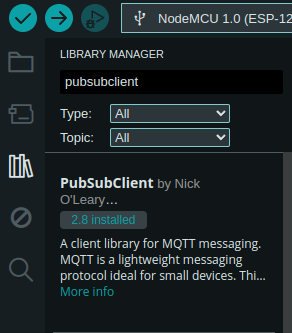

# Test invio dati con MQTT

## 1. Installazione delle librerie

Installare la libreria PubSubClient by *Nick O'Leary* nell'Arduino IDE:



## 2. Eseguire il codice

Copiare il codice seguente in un file nell'Arduino IDE e sostituire i seguenti campi coi valori corretti:

1. SSID
2. PASSWORD
3. IP_ADDRESS
4. USERNAME
5. MQTT_PASSWORD
6. TOPIC

Quindi collegare l'ESP8266 al pc e caricare il codice sul microcontrollore.

```
#include <ESP8266WiFi.h>
#include <PubSubClient.h>

const char* ssid = "SSID";
const char* password = "PASSWORD";

const char* mqtt_server = "IP_ADDRESS";

// MQTT broker credentials
const char* MQTT_username = "USERNAME";
const char* MQTT_password = "MQTT_PASSWORD";

// Initializes the espClient. You should change the espClient name
// if you have multiple ESPs running in your home automation system
WiFiClient espClient;
PubSubClient client(espClient);

// Don't change the function below. This functions connects your ESP8266 to your router
void setup_wifi() {
  delay(10);
  // We start by connecting to a WiFi network
  Serial.println();
  Serial.print("Connecting to ");
  Serial.println(ssid);
  WiFi.begin(ssid, password);
  while (WiFi.status() != WL_CONNECTED) {
    delay(500);
    Serial.print(".");
  }
  Serial.println("");
  Serial.print("WiFi connected - ESP IP address: ");
  Serial.println(WiFi.localIP());
}

// This functions is executed when some device publishes a message to a topic that your ESP8266 is subscribed to
// Change the function below to add logic to your program, so when a device publishes a message to a topic that 
// your ESP8266 is subscribed you can actually do something
void callback(String topic, byte* message, unsigned int length) {
  Serial.print("Message arrived on topic: ");
  Serial.print(topic);
  Serial.print(". Message: ");
  String messageString;
  
  for (int i = 0; i < length; i++) {
    Serial.print((char)message[i]);
    messageString += (char)message[i];
  }
  Serial.println();
}

// This functions reconnects your ESP8266 to your MQTT broker
// Change the function below if you want to subscribe to more topics with your ESP8266 
void reconnect() {
  // Loop until we're reconnected
  while (!client.connected()) {
    Serial.print("Attempting MQTT connection...");
    // Attempt to connect
    if (client.connect("ESP8266Client", MQTT_username, MQTT_password)) {
      Serial.println("connected");
    }
    else {
      Serial.print("failed, rc=");
      Serial.print(client.state());
      Serial.println(" try again in 5 seconds");
      // Wait 5 seconds before retrying
      delay(5000);
    }
  }
}

// The setup function sets your ESP GPIOs to Outputs, starts the serial communication at a baud rate of 115200
// Sets your mqtt broker and sets the callback function
// The callback function is what receives messages and actually controls the LEDs
void setup() {  
  Serial.begin(115200);
  setup_wifi();
  client.setServer(mqtt_server, 1883);
  client.setCallback(callback);
}

// For this project, you don't need to change anything in the loop function. Basically it ensures that you ESP is connected to your broker
void loop() {

  if (!client.connected()) {
    reconnect();
  }
  if(!client.loop()) {
    client.connect("ESP8266Client", MQTT_username, MQTT_password);

    client.publish("TOPIC", String(5).c_str());
    client.publish("TOPIC", String(6).c_str());
  }
}
```
